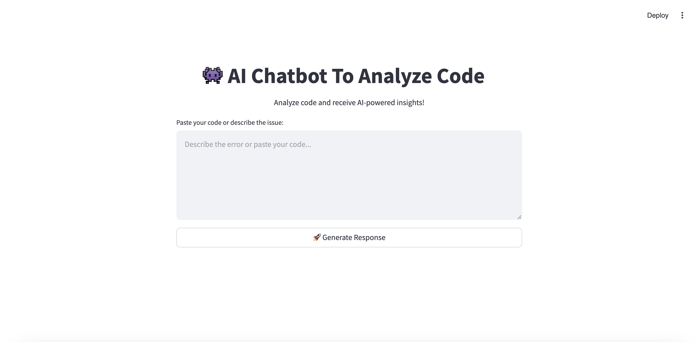
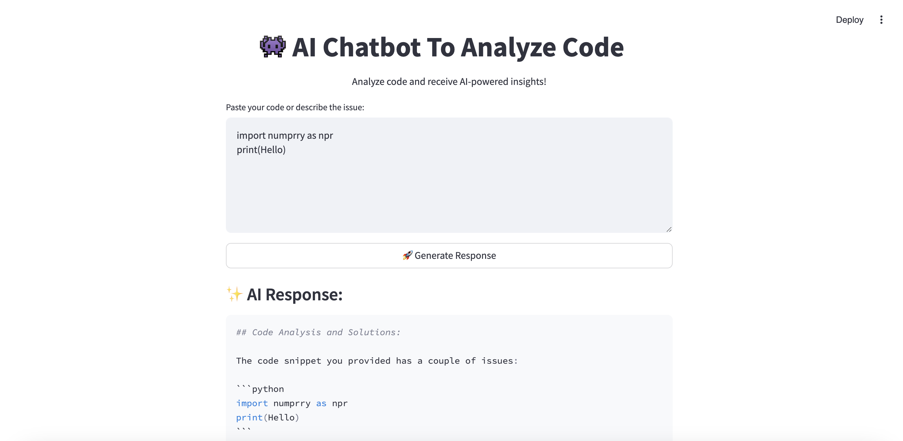
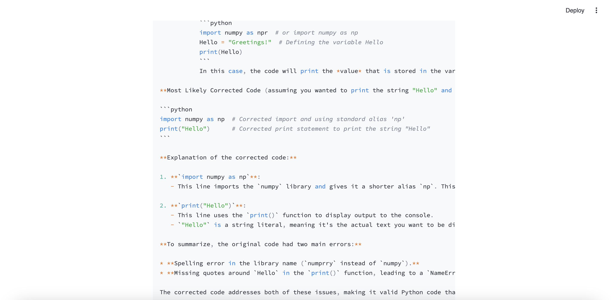

# GenAIApp - AI Chatbot for Code Analysis

## 🚀 Overview
GenAIApp is an AI-powered chatbot designed to analyze code snippets, identify issues, and provide intelligent solutions. Built with **Streamlit** and **Google Gemini API**, it delivers real-time insights to help developers debug and optimize their code efficiently.

## ✨ Features
- 📝 AI-driven code analysis with explanations  
- 🎨 User-friendly interface with enhanced styling  
- ⚡ Fast and interactive responses  
- 🔍 Error detection and optimization suggestions  
- 🔄 Supports multiple programming languages  

## 📌 Tech Stack
- **Python** (Backend processing)  
- **Streamlit** (UI framework)  
- **Google Gemini API** (AI-powered responses)  

## 📸 Screenshots
### Home Screen
  

### AI Response Example 1
  

### AI Response Example 2
  

## 🛠 Installation
### Clone the Repository
```bash
git clone https://github.com/214G1A32C1-VIJAYADURGA/GenAIApp.git
cd GenAIApp
```

### Set Up API Key
Replace `API_KEY` in `main.py` with your actual Google Gemini API key.

### Run the Application
```bash
streamlit run main.py
```

## Usage
1. Paste your code snippet or describe the issue.  
2. Click the **🚀 Generate Response** button.  
3. Get AI-powered insights and solutions!

## 📜 File Structure
```bash
GenAIApp/
│── main.py          # Main Streamlit application
│── README.md        # Documentation
│── .gitignore       # Git ignore file
│── output.png       # Screenshot - Home Screen
│── output1.png      # Screenshot - AI Response 1
│── output2.png      # Screenshot - AI Response 2
```
